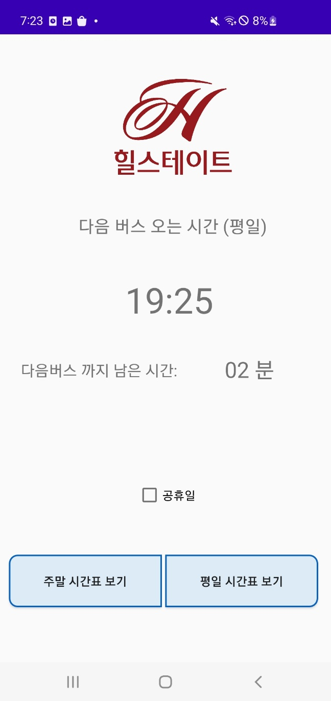

# BusTimer

Bus Timer Application for my neighbors living in *Hillstates River City*
Android Application developed in Java

Provides scheduled ETA (Estimated Time of Arrival) of buses around Hillstate River City stations.
The data was gathered from [OpenAPI of the Korean Government](https://www.data.go.kr/data/15034888/fileData.do?recommendDataYn=Y).

Here is an example of the screen

